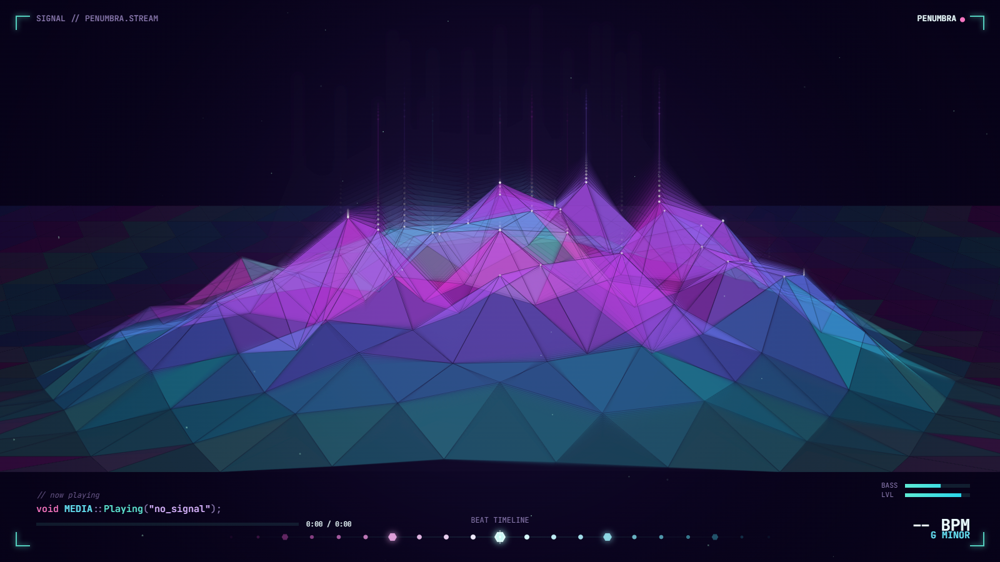
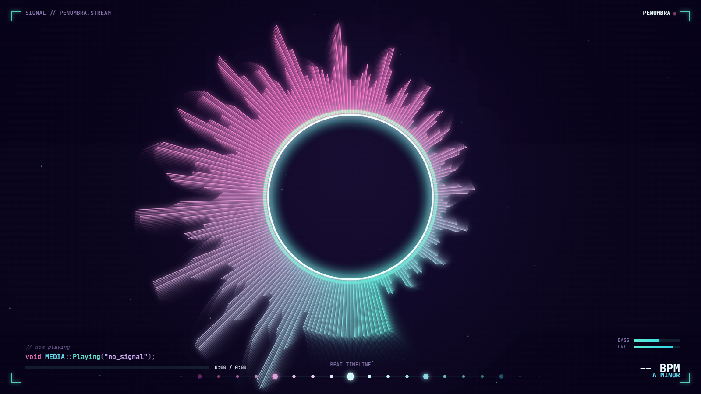
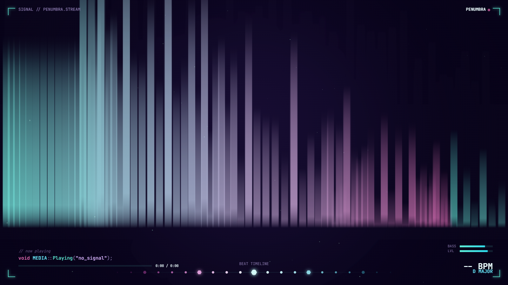
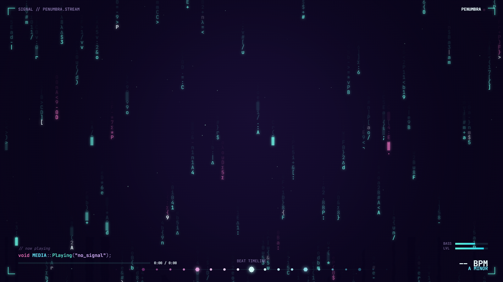
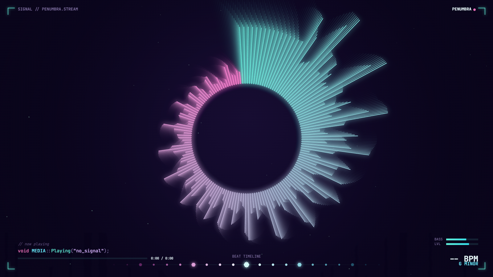
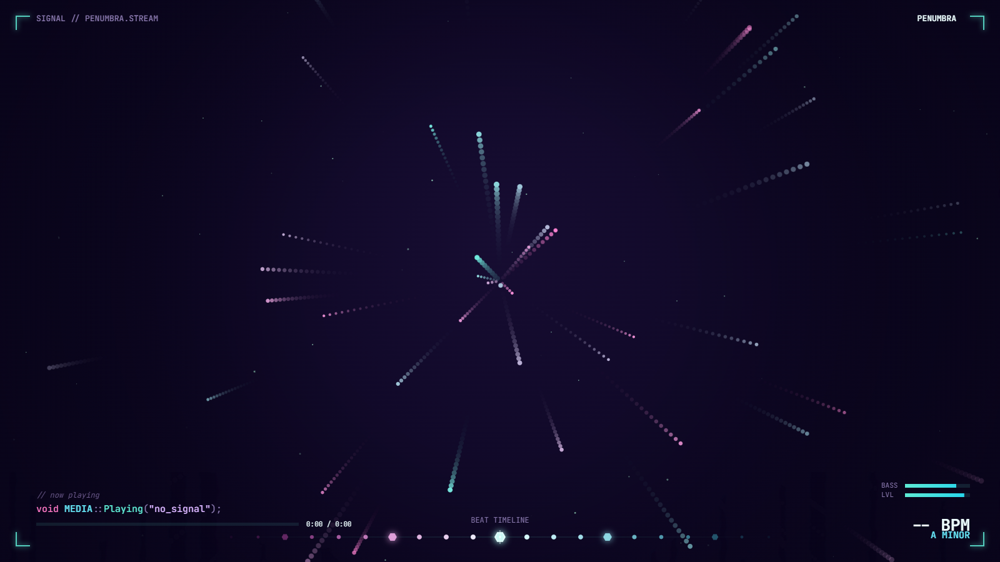

# PENUMBRA · Music Visualizer

A single-file, no-build, in-browser **music visualizer** with a hacker / eclipse aesthetic. Drop in a track (or capture a live stream), pick a visual, and it reacts to the real audio in real time — neon spectra, a 3D triangular-peaks terrain, code rain, aurora curtains, and an Unreal-Engine-style debug HUD with live BPM, key, and a beat timeline.

No install, no dependencies, no server — it's one `index.html`. Everything runs **100% locally**; nothing is uploaded.

### ▶ Demo

*(click for the full demo video)*

---

## Screenshots

| Triangular Peaks | Eclipse Core |
|---|---|
|  |  |

| Aurora Flow | Code Rain |
|---|---|
|  |  |

| Radial Spectrum | Particle Burst |
|---|---|
|  |  |

---

## Features

- **Real audio reactivity** — Web Audio `AnalyserNode` FFT drives every visual off the actual frequency/waveform data.
- **9 visualization modes** (see below), each with neon glow, trails, and the Penumbra palette.
- **Penumbra HUD overlay** — corona-bracket frame, header strip, a `void MEDIA::Playing("track")` now-playing readout with progress bar, live BASS/LVL meters, BPM, musical key, and a scrolling beat timeline.
- **Offline track analysis** — decodes the file and computes **BPM** (onset-envelope autocorrelation) and **musical key** (full-track chroma + Krumhansl-Schmuckler), **cached in `localStorage`** so each song is analyzed once.
- **Live audio capture** — visualize **streamed audio** (YouTube Music, Spotify web, anything) by capturing tab/system audio.
- **Playlist / queue** — load many tracks, drag-and-drop, auto-advance, prev/next.
- **Video recording** — capture the canvas + audio to a downloadable `.webm` (great for mix-video intros / now-playing scenes).
- **Auto / random mode** — shuffles visuals + settings on a timer, hands-free.
- **Backgrounds** — optionally composite visuals over a looping video or image (non-Penumbra modes).
- **Live controls** — reactivity, trails, color-shift speed, visualizer height, brightness, volume, 5 color themes.

## Visualization modes

**Penumbra**
- **Triangular Peaks** — a wide 3D perspective lattice of equilateral triangles (hex tiles) where the spectrum radiates from the center into a mountain of peaks, with vertical laser streaks and flowing color.
- **Eclipse Core** — the signature pulsing corona ring with the spectrum as corona spikes.
- **Code Rain** — Matrix-style falling C++/hex glyphs whose fall speed tracks the music.

**Spectrum**
- Radial Spectrum · Waveform · Mirror Bars · Pulse Rings · Tunnel Grid · Particle Burst · Aurora Flow

## Usage

1. Open `index.html` in a modern browser (Chrome/Edge recommended).
2. **Load tracks** (button or drag-and-drop MP3/WAV/OGG). Optionally load a background video/image.
3. Pick a visual from the dropdown, hit play, and tweak the sliders.
4. **Click the visualization** to play/pause. Mouse-away hides the controls.

### Visualizing streamed audio (YouTube Music, etc.)
Click **🎙️**, choose the tab playing audio, and **tick "Share tab audio."** The visualizer reacts to that stream live. (Offline BPM/key analysis only works on local files; streams show the live estimate. Tab-audio capture is a Chrome/Edge feature.)

### Recording
Click **⏺** to record the canvas + audio to a `.webm`. Click again to stop and download. YouTube accepts `.webm` directly.

### Keyboard
`Space` play/pause · `F` fullscreen · `H` toggle HUD · `←/→` seek ±5s

## Tech

- Pure HTML/CSS/JS in a **single file** — no build step, no frameworks, no dependencies.
- **Web Audio API** (`AnalyserNode`, `MediaElementSource`, `MediaStreamSource`, `MediaStreamDestination`) for analysis, capture, and recording.
- **Canvas 2D** with an offscreen FX layer composited via `lighten`/`screen` blends for the glow.
- A small in-file **FFT** powers the offline BPM/key analyzer.
- **JetBrains Mono** + the Penumbra palette (corona teal, void purple-black, vaporwave-Rider syntax colors).

## License

See repository license. Part of the **Penumbra** stream toolkit.
